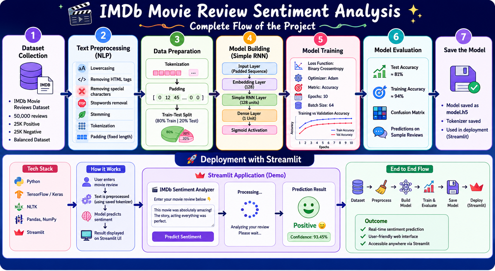

# 🎬 IMDb Movie Review Sentiment Analysis using Deep Learning & NLP

## 📌 Project Overview

This project performs **sentiment analysis on IMDb movie reviews** using **Natural Language Processing (NLP)** and **Deep Learning** techniques. The model classifies movie reviews as **Positive** or **Negative**.

The solution uses:

* Text preprocessing and tokenization
* Embedding Layer for word representation
* Simple RNN (Recurrent Neural Network) for sequence modeling
* TensorFlow/Keras for model development
* Deployment as a web application for real-time predictions

---

## 🚀 Features

* Binary sentiment classification (Positive / Negative)
* NLP preprocessing pipeline
* Word Embeddings for semantic representation
* Simple RNN architecture
* Real-time prediction through deployed application
* Easy-to-use interface

---

## 📂 Dataset

Dataset used: **IMDb Movie Reviews Dataset**

* 50,000 movie reviews
* Balanced dataset
* 25,000 positive reviews
* 25,000 negative reviews

Source: IMDb Dataset available through TensorFlow/Keras datasets.

---

## 🛠️ Technologies Used

* Python
* TensorFlow / Keras
* NumPy
* Pandas
* Scikit-learn
* NLTK
* Streamlit 
* Git & GitHub

---

## 🏗️ Model Architecture

```text
Input Review
      │
      ▼
Tokenization
      │
      ▼
 Padding
      │
      ▼
 Embedding Layer
      │
      ▼
 Simple RNN Layer
      │
      ▼
 Dense Layer
      │
      ▼
 Sigmoid Activation
      │
      ▼
 Sentiment Output
```
### Architecture Summary

```python
model = Sequential([
    Embedding(vocab_size, embedding_dim, input_length=max_length),
    SimpleRNN(128),
    Dense(1, activation='sigmoid')
])
```
-

---

## 📊 Training Details

| Parameter           | Value               |
| ------------------- | ------------------- |
| Embedding Dimension | 128                 |
| RNN Units           | 128                 |
| Loss Function       | Binary Crossentropy |
| Optimizer           | Adam                |
| Metric              | Accuracy            |


---

## 📈 Results

| Metric              | Score |
| ------------------- | ----- |
| Training Accuracy   | 94%   |
| Test Accuracy       | 81%   |

Example:

```text
Positive Review → Positive 😊
Negative Review → Negative 😞
```

---

## 🌐 Deployment

The model has been deployed for real-time sentiment prediction.

### Demo
```text
https://deeplearning-nlprnnsentimentanalysis-osktgimuozgbhc5kkhjtch.streamlit.app/
```
---

## 📥 Installation

Clone the repository:

```bash
git clone https://github.com/Shaik-NowshinFarhana/DeepLearning-NLP_RNN_SentimentAnalysis.git
```

Install dependencies:

```bash
pip install -r requirements.txt
```

Run the application:

```bash
streamlit run main.py
```

---
## 📁 Project Structure

```text
imdb-sentiment-analysis/
│
├── app.py
├── model.h5
├── requirements.txt
├── notebooks/
│   └── imdb_sentiment.ipynb
├── images/output1.jpg
├── README.md
```


---
## 🔮 Future Improvements

* Use LSTM and GRU models
* Implement Bidirectional RNNs
* Multi-class sentiment analysis

